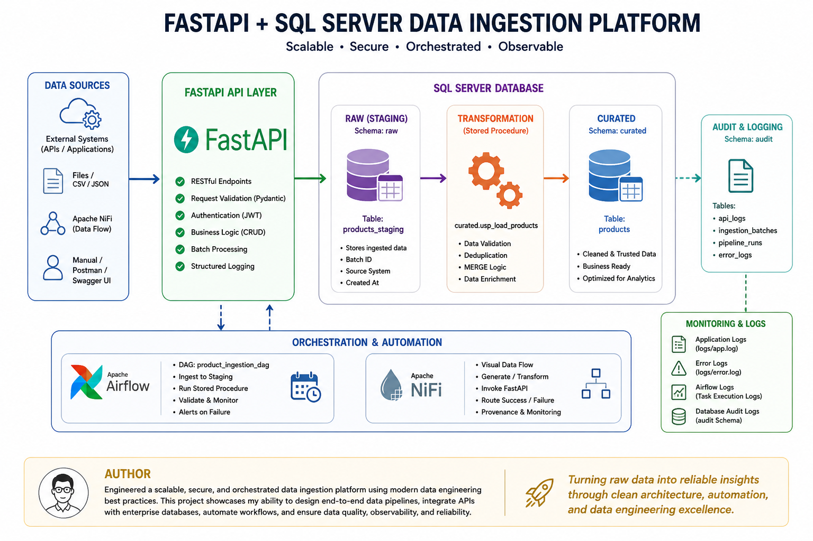

# FastAPI + SQL Server Data Ingestion Tool

## Overview

This project demonstrates a **production-style data ingestion pipeline** built using:

* **FastAPI** for API-based ingestion and orchestration
* **Microsoft SQL Server** for staging and curated data storage
* **Apache Airflow (Dockerized)** for workflow orchestration
* **Apache NiFi (Dockerized)** for flow-based ingestion
* **Structured Logging** for observability and debugging

The system follows a **modern data engineering pattern**:

```text
Data Source → FastAPI → Staging (raw) → Stored Procedure → Curated Layer → Analytics
```

---

## Architecture

```text
                +----------------------+
                | External Systems     |
                | (API / Files / NiFi) |
                +----------+-----------+
                           |
                           v
                  +----------------+
                  |   FastAPI API  |
                  | (Ingestion Layer)
                  +--------+-------+
                           |
                           v
            +-----------------------------+
            | SQL Server (Raw / Staging)  |
            +-----------------------------+
                           |
                           v
            +-----------------------------+
            | Stored Procedure (MERGE)    |
            +-----------------------------+
                           |
                           v
            +-----------------------------+
            | SQL Server (Curated Layer)  |
            +-----------------------------+
                           |
                           v
                  +----------------+
                  | Reporting / BI |
                  +----------------+

Optional:
Airflow → orchestrates ingestion & load  
NiFi → visual ingestion & routing
```

<h2>Diagram</h2>

<p align="center">
  
</p>


## Features

* RESTful API using FastAPI
* Bulk ingestion endpoint
* SQL Server integration using SQLAlchemy + pyodbc
* Staging → Curated data flow
* Stored procedure-based transformation (MERGE logic)
* Structured logging (file + console)
* Airflow DAG for orchestration
* NiFi flow for ingestion simulation
* Batch-level ingestion tracking (batch_id)

---

## Tech Stack

| Layer         | Technology                           |
| ------------- | ------------------------------------ |
| API Layer     | FastAPI                              |
| Language      | Python                               |
| Database      | SQL Server                           |
| ORM           | SQLAlchemy                           |
| Orchestration | Apache Airflow (Docker)              |
| Data Flow     | Apache NiFi (Docker)                 |
| Logging       | Python Logging (RotatingFileHandler) |

---

## Project Structure

```text
fastapi-sqlserver-ingestion/
│
├── app/
│   ├── main.py
│   ├── database.py
│   ├── models.py
│   ├── schemas.py
│   ├── crud.py
│   ├── logging_config.py
│   └── routers/
│       └── products.py
│
├── airflow/
│   └── dags/
│       └── product_ingestion_dag.py
│
├── sql/
│   └── setup.sql
│
├── logs/
├── docker-compose.yml
├── requirements.txt
└── README.md
```

---

## Setup Instructions

### 1. Clone repository

```bash
git clone [<repo_url>](https://github.com/DevOne-01/fastapi-sqlserver-ingestion.git)
cd fastapi-sqlserver-ingestion
```

---

### 2. Create virtual environment

```bash
python -m venv venv
venv\Scripts\activate
```

---

### 3. Install dependencies

```bash
pip install -r requirements.txt
```

---

### 4. Configure environment variables

Create `.env`:

```env
DB_SERVER=localhost
DB_NAME=ProductIngestionDB
DB_USER=your_user
DB_PASSWORD=your_password
DB_DRIVER=ODBC Driver 17 for SQL Server
```

---

### 5. Setup SQL Server

Run:

```sql
sql/setup.sql
```

This creates:

* raw schema (staging)
* curated schema
* audit schema
* stored procedure for MERGE

---

### 6. Run FastAPI

```bash
uvicorn app.main:app --reload
```

Swagger UI:

```text
http://127.0.0.1:8000/docs
```

---

## API Endpoints

### 1. Ingest Products (Staging)

```http
POST /products/ingest
```

Payload:

```json
[
  { "name": "Apple", "price": 100, "category": "fruits" },
  { "name": "Milk", "price": 80, "category": "dairy" }
]
```

---

### 2. Load to Curated Layer

```http
POST /products/load
```

Executes stored procedure:

```text
curated.usp_load_products
```

---

### 3. Get Curated Data

```http
GET /products/curated
```

---

## Logging

Logs are stored in:

```text
logs/app.log
logs/error.log
```

Each request logs:

* request_id
* endpoint
* method
* status_code
* execution time

Example:

```text
Request started | request_id=xyz | method=POST | path=/products/ingest
Request completed | status_code=201 | execution_time_ms=45
```

---

## Airflow Setup (Docker)

```bash
curl -LfO https://airflow.apache.org/docs/apache-airflow/stable/docker-compose.yaml
docker compose up airflow-init
docker compose up
```

Airflow UI:

```text
http://localhost:8080
```

DAG:

```text
product_ingestion_dag
```

Flow:

```text
Ingest → Load → Validate
```

---

## NiFi Setup (Docker)

```bash
docker compose up -d nifi
```

UI:

```text
https://localhost:8443/nifi
```

Use:

```text
GenerateFlowFile → ReplaceText → InvokeHTTP
```

---

## Data Flow Design

```text
FastAPI inserts → raw.products_staging
Stored Procedure → curated.products
```

Benefits:

* separation of concerns
* scalable ingestion
* DB-level transformations
* idempotent MERGE logic

---

## Best Practices Implemented

* Layered architecture (routers, schemas, models, CRUD)
* Batch-based ingestion
* Stored procedure-driven transformations
* Structured logging
* Separation of staging vs curated data
* Docker-based orchestration tools

---

## Future Enhancements

* JWT Authentication + RBAC
* Data quality checks and rejected records table
* Batch tracking tables
* Full Dockerization (FastAPI)
* CI/CD pipeline
* Monitoring dashboards (Grafana / Prometheus)

---

## Author

Built as a **data engineering portfolio project** demonstrating:

* API-driven ingestion
* SQL Server data modeling
* Orchestration with Airflow
* Flow-based ingestion with NiFi
* Production-style logging and architecture

---
